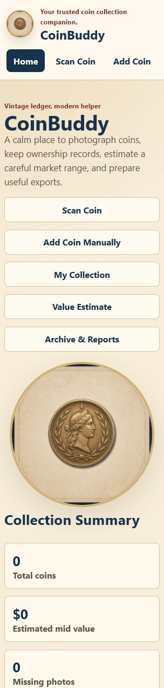

# CoinBuddy

CoinBuddy is a simple, warm coin-collection app built as a gift-quality personal collection companion. It helps a less technical collector photograph coins, add inventory details, review estimated market ranges, keep archive records, learn safe storage basics, and export collection records.

The first MVP is a dependency-light, local-first PWA so it can run reliably in this workspace without a package manager. It keeps the requested React/Vite path open for a later upgrade, but the current build is usable as a standalone browser app.

## Who It Is For

Primary user: a family coin collector who wants clear buttons, friendly wording, safe manual fallbacks, and exportable records without technical setup.

## Current MVP Features

- Home dashboard with collection totals, recent coins, and needs-review alerts
- Add Coin Manually flow
- Scanner-style image upload flow for obverse and reverse photos
- My Collection search, sort, and filters
- Coin detail page with edit, delete confirmation, value range, and comparable sale entry
- Manual value estimator with low, mid, high, confidence, source, and date
- Archive & Reports with printable summary, JSON export, and CSV export
- Learn page with static storage, insurance-prep, grading, handling, and beginner guidance
- Auctions page with curated sources plus user-added source links
- Settings page with export/import, theme choice, and storage status
- Local browser storage with no client-side service secrets

## Screenshot



The app includes a generated brand accent at `src/assets/coinbuddy-medallion.png`.

## Install

No dependencies are required for the MVP. Use Node.js 20 or newer.

```bash
node --version
```

If your machine has npm, the matching `npm run ...` scripts are available. The direct Node commands below are the canonical MVP commands and do not require a package-manager install.

## Run Locally

```bash
node scripts/serve.mjs
```

Then open:

```text
http://127.0.0.1:4173
```

## Test

```bash
node scripts/lint.mjs
node --test src/tests/*.test.mjs
node scripts/browser-test.mjs
```

## Build

```bash
node scripts/build.mjs
```

The static site is copied to `dist/`.

## React/Vite Scaffold Note

The branch currently includes an early React/Vite scaffold for a possible future migration. The active, verified MVP remains the dependency-light static PWA loaded by `index.html` and `src/app/main.js`.

## Data And Storage

CoinBuddy stores data in the browser's `localStorage` for the MVP. Coin photos are saved as data URLs, which is convenient but not ideal for very large photo libraries. The storage plan in `docs/storage-plan.md` describes the future Supabase path.

## Roadmap

See `ROADMAP.md` for phased work. The next major steps are cloud sync, real camera capture improvements, permitted market data integrations, report PDFs, and optional professional appraisal workflow support.

Next recommended items:

- Let Hermes complete the final product/docs/UX review.
- Decide whether to launch the static PWA first or migrate the active app into the React/Vite scaffold.
- Add PDF reports after JSON/CSV exports are accepted.
- Add safe cloud sync only after Supabase security boundaries are reviewed.

## Known Limitations

- Value estimates are manual ranges based on user-entered comparable sales.
- Coin identification and grading are not automated yet.
- Browser local storage is not a long-term image archive for very large collections.
- Auction links are curated or user-added; CoinBuddy does not scrape third-party sites.
- The MVP is not legal, financial, insurance, or appraisal advice.

## Value Estimate Disclaimer

CoinBuddy shows estimated market ranges for personal organization and research. These estimates are not official appraisals, guaranteed sale prices, insurance coverage decisions, legal advice, or financial advice. For high-value coins, coverage questions, estate planning, or official valuations, consult a qualified professional.
